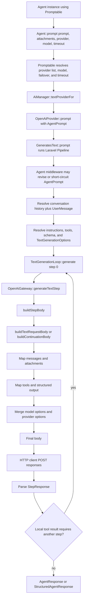

# Laravel AI Internals Research

Research date: 2026-07-19

This document covers the Laravel AI side of request resolution for Laravel AI Batch. It deliberately does not specify the OpenAI Batch lifecycle, limits, or status model; those belong in the OpenAI-specific research.

## Source snapshot

Two upstream snapshots were inspected:

- Latest released version: [`laravel/ai` v0.9.1](https://github.com/laravel/ai/releases/tag/v0.9.1), tag commit [`2760a62bff6ab515cdf10222f61b7973356450e1`](https://github.com/laravel/ai/commit/2760a62bff6ab515cdf10222f61b7973356450e1), published 2026-07-15.
- Current `0.x` branch head at research time: commit [`a1b3ce7437adb8bda22eb4e0308a376cd64da3d9`](https://github.com/laravel/ai/commit/a1b3ce7437adb8bda22eb4e0308a376cd64da3d9), authored 2026-07-18.

The implementation recommendation targets the released v0.9.1 code. The newer branch head was compared to identify near-term compatibility hazards; it is not a released compatibility target.

## Conclusion

Laravel AI v0.9.1 does **not** expose a public API that returns the final provider request without sending it. The exact first OpenAI request body is assembled by the protected `OpenAiGateway::buildStepBody()` / `buildTextRequestBody()` path immediately before `POST responses`. Rebuilding that body in Laravel AI Batch would duplicate rapidly changing message, attachment, tool, schema, and provider-option mapping.

The narrowest exact strategy is therefore:

1. Resolve one explicit OpenAI provider connection and model.
2. Clone its `OpenAiProvider` so no shared provider instance is mutated.
3. Install a package-private capture gateway through the public `TextProvider::useTextGateway()` seam.
4. Call the cloned provider's normal synchronous `prompt(AgentPrompt)` path so Laravel AI resolves middleware, conversation messages, instructions, the current user prompt, attachments, tools, structured output, attributes, and provider options.
5. In a package-private `OpenAiGateway` subclass, call the inherited protected `buildStepBody()` with the exact arguments delivered to `generateTextStep()`, then throw a private sentinel carrying the body. No HTTP client is constructed and no provider request is sent.
6. Convert the capture into this package's own immutable request DTO: provider identifier, `POST`, `/v1/responses`, and body. Do not expose provider objects, Laravel AI gateway objects, credentials, or authorization headers.

This approach composes the public provider/gateway contracts and selectively adapts one protected OpenAI payload builder. It is narrower and more faithful than copying Laravel AI's mapping traits. It is also safer than temporarily installing a global `Http::fake()`, which would mutate process-global HTTP state and require synthesizing a response.

Because `buildStepBody()` is protected and undocumented, the adapter must be version-specific, guarded by parity tests, and replaceable if Laravel AI adds the resolved-request API requested in issue #767.

## Supported PHP and Laravel versions

The released v0.9.1 `composer.json` requires:

| Component | Upstream constraint |
| --- | --- |
| PHP | `^8.3` |
| Illuminate / Laravel components | `^12.0\|^13.0` |
| `illuminate/json-schema` | `^12.62\|^13.15` |
| Orchestra Testbench (development) | `^10.6\|^11.0` |

These constraints are unchanged at the inspected `0.x` branch head. See the [v0.9.1 Composer manifest](https://github.com/laravel/ai/blob/v0.9.1/composer.json#L15-L43).

For this package's first release, the safest dependency policy is exact `laravel/ai: 0.9.1` while the internal adapter is established. Expand to `~0.9.1` only after every allowed patch is exercised by the payload-parity suite. Do not claim compatibility with unreleased `0.x`, `1.x`, or an open-ended `^0` range.

Suggested CI coverage for the selected Laravel AI release:

- PHP 8.3 with Laravel 12 and Laravel 13.
- Current supported PHP 8.4/8.5 combinations with Laravel 12/13 where Composer resolves them.
- Lowest and highest dependency sets.
- A dedicated parity suite that compares this resolver's body to the real v0.9.1 synchronous request captured by Laravel's HTTP fake for the same agent invocation.

## Complete synchronous OpenAI path



### 1. Agent invocation and provider/model resolution

`Promptable::prompt()` is the documented entry point. It resolves provider/model candidates, iterates failover choices, resolves the provider through `Ai::textProviderFor()`, applies an explicitly passed model or agent method/attribute, and otherwise selects the provider's default/cheapest/smartest model. It then creates an `AgentPrompt` and calls the selected provider. See [`Promptable`](https://github.com/laravel/ai/blob/v0.9.1/src/Promptable.php#L37-L68) and its [provider/model resolution](https://github.com/laravel/ai/blob/v0.9.1/src/Promptable.php#L205-L322).

Relevant precedence:

- Explicit `prompt(provider: ..., model: ...)` arguments win.
- With no explicit provider, `agent->provider()` wins over `#[Provider]`, then `config('ai.default')`.
- With no explicit model, `agent->model()` wins over `#[Model]`.
- If no concrete model remains, `#[UseSmartestModel]`, `#[UseCheapestModel]`, or the provider default supplies it.
- A provider array represents failover. A provider-native batch request cannot preserve response-time failover, so v1 should require exactly one explicit OpenAI connection and reject arrays.

The provider/model/timeout options and attribute forms are documented in the official [Laravel AI SDK agent configuration](https://laravel.com/docs/13.x/ai-sdk#agent-configuration).

### 2. Provider prompt orchestration

`OpenAiProvider` implements `TextProvider` and imports `GeneratesText`. `GeneratesText::prompt()`:

- runs the `AgentPrompt` through agent middleware;
- dispatches `PromptingAgent`;
- snapshots `Conversational::messages()` and appends a `UserMessage` containing the prompt and attachments;
- resolves agent tools, wrapping sub-agents and MCP tools;
- resolves a structured schema through `JsonSchemaTypeFactory`;
- resolves max steps, max tokens, temperature, top-p, tool choice, and provider options into `TextGenerationOptions`;
- enters `TextGenerationLoop`.

See [`GeneratesText::prompt()`](https://github.com/laravel/ai/blob/v0.9.1/src/Providers/Concerns/GeneratesText.php#L35-L93) and [`resolveTools()`](https://github.com/laravel/ai/blob/v0.9.1/src/Providers/Concerns/GeneratesText.php#L118-L145).

Middleware matters: it can revise the prompt before resolution or short-circuit without reaching a provider request. The resolver must run middleware for payload parity, but must fail explicitly if middleware short-circuits or swallows the capture sentinel. The official docs describe this transformation seam under [agent middleware](https://laravel.com/docs/13.x/ai-sdk#middleware).

### 3. Multi-step generation loop

`TextGenerationLoop::generate()` calls `StepTextGateway::generateTextStep()` with provider, model, instructions, normalized message objects, normalized tool objects, schema, options, timeout, and a `StepContext`. If the model returns local tool calls, the loop executes them in PHP and issues another provider request. See [`TextGenerationLoop`](https://github.com/laravel/ai/blob/v0.9.1/src/Gateway/TextGenerationLoop.php#L26-L113) and the public [`StepTextGateway` contract](https://github.com/laravel/ai/blob/v0.9.1/src/Contracts/Gateway/StepTextGateway.php#L12-L57).

This boundary is semantically rich but is not yet a provider-ready request: messages, tools, schema, and options are still Laravel AI objects.

### 4. Final OpenAI payload construction and send

`OpenAiGateway::generateTextStep()` calls protected `buildStepBody()` and then sends:

```php
$this->client($provider, $timeout)->post('responses', $body);
```

See [`HandlesTextSteps`](https://github.com/laravel/ai/blob/v0.9.1/src/Gateway/OpenAi/Concerns/HandlesTextSteps.php#L13-L39). With the default base URL, the synchronous request is `POST https://api.openai.com/v1/responses`; the Batch JSONL relative URL is therefore `/v1/responses`.

For an initial request, `buildStepBody()` delegates to `buildTextRequestBody()`. A synchronous tool continuation may instead use `buildContinuationBody()` with `previous_response_id`; see [`buildStepBody()`](https://github.com/laravel/ai/blob/v0.9.1/src/Gateway/OpenAi/Concerns/HandlesTextSteps.php#L69-L85).

The final initial body is constructed in [`BuildsTextRequests`](https://github.com/laravel/ai/blob/v0.9.1/src/Gateway/OpenAi/Concerns/BuildsTextRequests.php#L13-L124):

- `model`.
- `input`, after instructions, conversation messages, the new user message, tool-call history, tool results, and attachments are mapped to Responses API items.
- `tools` and `tool_choice` when tools exist.
- `text.format` for structured JSON-schema output.
- `max_output_tokens`, `temperature`, and `top_p` when configured.
- the complete agent `providerOptions()` array, merged last and therefore capable of overriding prior fields.
- `store: false` for a stateless OpenAI connection, plus `reasoning.encrypted_content` in `include` for recognized reasoning models.

Mapping is distributed among protected traits:

- [`MapsMessages`](https://github.com/laravel/ai/blob/v0.9.1/src/Gateway/OpenAi/Concerns/MapsMessages.php) adds system instructions and maps user, assistant, function-call, and tool-result history.
- [`MapsAttachments`](https://github.com/laravel/ai/blob/v0.9.1/src/Gateway/OpenAi/Concerns/MapsAttachments.php) resolves provider IDs, remote URLs, uploaded files, local/storage-backed files, and base64 data.
- [`MapsTools`](https://github.com/laravel/ai/blob/v0.9.1/src/Gateway/OpenAi/Concerns/MapsTools.php) maps function tools and OpenAI-native file/web search tools.
- [`TextGenerationOptions`](https://github.com/laravel/ai/blob/v0.9.1/src/Gateway/TextGenerationOptions.php) resolves attributes, agent methods, tool choice, and `HasProviderOptions`.

Authorization is added separately when the internal HTTP client is created. It is not part of the request body and must not appear in this package's resolved-request DTO. See [`CreatesOpenAiClient`](https://github.com/laravel/ai/blob/v0.9.1/src/Gateway/OpenAi/Concerns/CreatesOpenAiClient.php).

## Public APIs and stability classification

“Public” below distinguishes documented application APIs from merely public PHP methods. A public method on an internal namespace is not automatically a promised extension point.

| Surface | Classification | Use by this package |
| --- | --- | --- |
| `Agent`, `Promptable`, `Agent::make()`, `prompt()` arguments | Documented public API; stable relative to v0.9 | Accept real agent instances/classes and mirror invocation inputs. |
| `HasTools`, `HasStructuredOutput`, `HasProviderOptions`, `HasMiddleware`, `Conversational` and agent attributes | Documented public contracts; stable | Do not reimplement them; let Laravel AI resolve them. |
| `Lab`, provider connection names, configured models | Documented public API; stable | Accept a single explicit OpenAI connection. |
| `AiManager::textProvider()` / `TextProvider` | Public contract/code API, lightly documented as an extension surface | Resolve the configured provider without exposing it publicly. |
| `StepTextGateway` and `TextProvider::useTextGateway()` | Public contracts; best available extension seam, but not documented as a request-resolution API | Install a capture gateway on a cloned provider. Keep entirely internal. |
| `AgentPrompt` constructor | Public class but orchestration detail | Use only inside the versioned adapter. Never expose in package signatures. |
| `GeneratesText`, `TextGenerationLoop`, `TextGenerationOptions`, `StepContext`, `StepResponse` | Internal orchestration details | Observe through the gateway contract only; never expose. |
| `OpenAiGateway` and all `Gateway\OpenAi\Concerns\*` traits | Provider internals; fragile | Versioned adapter may subclass `OpenAiGateway` and call exactly one protected method, `buildStepBody()`. |
| `Provider::providerCredentials()`, internal `PendingRequest`, authorization header | Sensitive internal transport data | Must not leak into DTOs, logs, serialized exceptions, events, or JSONL. |

## Recommended request-resolution adapter

The package should own a stable contract such as `ResolvesProviderRequests`, while the v0.9.1 implementation is isolated in a compatibility namespace or class. The public `ResolvedProviderRequest` should contain only package-owned primitives/DTOs.

Conceptual algorithm (not production code):

```text
resolve(agent, prompt, attachments, openAiConnection, optionalModel)
  require one explicit provider connection
  provider := AiManager.textProvider(connection)
  require provider is the native OpenAiProvider / driver "openai"
  model := resolve documented explicit/method/attribute/default precedence
  captureGateway := OpenAiGateway subclass using the app event dispatcher
  clonedProvider := clone provider
  clonedProvider.useTextGateway(captureGateway)
  agentPrompt := new AgentPrompt(agent, prompt, attachments, clonedProvider, model, timeout)

  try clonedProvider.prompt(agentPrompt)
  catch private CapturedOpenAiRequest(body):
    return package DTO(connection, "openai", "POST", "/v1/responses", body)

  if prompt returned normally:
    throw RequestResolutionException("middleware short-circuited provider resolution")
```

The capture gateway's synchronous step method should:

1. Assert step zero and no continuation token.
2. Call inherited protected `buildStepBody()` with the received arguments.
3. Throw a package-private sentinel containing the body before calling `client()`.

The provider is cloned before `useTextGateway()` because `AiManager` caches provider instances. Mutating the shared instance would redirect unrelated synchronous calls in long-lived workers.

### Why not the alternatives?

| Alternative | Assessment |
| --- | --- |
| Copy all OpenAI mapping traits into this package | Most fragile by surface area and guarantees drift. Reject. |
| Invoke protected mappers independently through reflection | Couples to more methods and can bypass middleware/order. Reject. |
| Globally `Http::fake()` and perform a normal prompt | Produces an exact sent request in tests, but mutates global HTTP state, requires a fake response, may execute tools/follow-up requests, and is unsafe in workers. Use only as the parity oracle in tests. |
| Decorate `TextProvider::prompt()` | The provider receives an `AgentPrompt`, not the resolved OpenAI body. Insufficient. |
| Capture only `StepTextGateway` arguments | Still contains Laravel AI message/tool/schema objects, not the final provider body. Insufficient without the protected builder. |
| Build a separate public agent/request DSL | Violates the package objective and creates two sources of truth. Reject. |

## Features preserved by the proposed path

For the first provider request, the path preserves Laravel AI v0.9.1 behavior for:

- agent instructions;
- prompt text and supported attachments;
- existing conversation messages as read at resolution time;
- explicit, method-based, attribute-based, and configured model selection;
- max-token, temperature, top-p, strict, and tool-choice attributes/methods;
- provider options, including arbitrary OpenAI body fields;
- structured-output JSON schema;
- normal tools, sub-agent tools, MCP tool definitions, and OpenAI provider-tool definitions at serialization time;
- middleware revisions that reach the provider;
- OpenAI stateless/store configuration and encrypted reasoning inclusion.

“Preserved at serialization time” does not mean the feature can complete inside one provider-native batch request. Local tool execution is the principal example.

## Required unsupported cases and limitations

The resolver must throw specific exceptions rather than silently approximate these cases:

1. **Provider failover arrays.** A batch item is submitted once and cannot preserve synchronous response-time failover.
2. **Non-native OpenAI providers.** Azure OpenAI, `openai-compatible`, proxy connections, or a custom OpenAI base URL are not automatically the native OpenAI Batch API. Require a verified native OpenAI connection in v1.
3. **Laravel-side tool loops.** The captured body is the first synchronous step only. PHP tools, agent-as-tool, and MCP tools cannot be executed by Laravel after an asynchronous provider response without a later batch continuation workflow. V1 should reject local tools. OpenAI-native provider tools may be allowed only if the separate Batch API research confirms endpoint support.
4. **Tool approval/resumption.** This is already present on the inspected post-v0.9.1 branch and changes prompt and loop signatures. It is not supported by the v0.9.1 adapter and must not be claimed through a broadened dependency constraint.
5. **Short-circuiting middleware.** No provider request exists. Throw `RequestResolutionException`.
6. **Middleware/event side effects.** Exact resolution runs the normal middleware pipeline and dispatches `PromptingAgent` before capture. Arbitrary middleware can read/write external state or catch the sentinel. This limitation must be documented. The built-in conversation middleware persists only after a response completes, but custom middleware has no dry-run signal.
7. **Conversation writes.** Resolution snapshots existing history but does not produce a real `AgentResponse`; it must not claim to append a completed assistant turn. Applications needing batch conversation persistence require an explicit result-processing design.
8. **Faked agents/providers.** Test fakes replace the real text gateway and do not prove provider payload parity. The production resolver should reject an active Laravel AI agent fake; package tests should instead use the real resolver plus no-stray-request assertions.
9. **Streaming and queued-agent APIs.** They are separate execution modes and are not inputs to provider-native batch resolution.
10. **Attachment I/O.** Mapping local or storage-backed attachments reads their content during resolution and may base64-expand it into a JSONL line. Missing files, oversized lines, unavailable disks, and remote/provider file lifetimes must fail visibly.
11. **Provider options can overwrite core fields.** Laravel AI merges provider options after model/input/tools/schema. This is exact behavior, but the batch layer must validate the resulting endpoint/body rather than assuming required fields survived.
12. **Metadata.** Laravel AI v0.9.1 has no separate agent metadata contract in this path. OpenAI metadata is preserved only when supplied through provider options.

## Compatibility hazards

Laravel AI is pre-1.0 and the exact integration point is protected. The comparison between v0.9.1 and the current `0.x` head already shows material internal change:

- `Agent::prompt()` now accepts approval decisions as well as strings.
- `AgentPrompt` gained approval state.
- `GeneratesText` now sanitizes foreign provider content blocks, resolves resumable approvals, and changed conversation middleware behavior.
- `TextGenerationLoop` gained approval-aware message settlement and new parameters.
- Tool-choice handling in the OpenAI body builder changed its guard.

The capture boundary still exists at the inspected branch head, but that is not a compatibility guarantee. See the [v0.9.1-to-current comparison](https://github.com/laravel/ai/compare/v0.9.1...0.x).

Required defenses:

- Keep all Laravel AI internals behind one versioned adapter selected by installed package version.
- Fail package boot or resolution with a clear unsupported-version exception when no adapter matches.
- Pin Composer deliberately; do not let an untested minor release install.
- Add reflection/signature contract tests for `OpenAiGateway`, `buildStepBody`, `StepTextGateway`, `AgentPrompt`, and `TextProvider::useTextGateway`.
- Add golden parity fixtures covering basic text, instructions/history, every supported attachment family, structured output, strictness, model options, provider options, tool choice, native provider tools, stateless mode, and middleware revisions.
- For every fixture, assert the resolved body is byte-for-structure equal to the body observed from Laravel AI's real synchronous path under `Http::fake()`.
- Assert `Http::preventStrayRequests()` sees zero requests during package resolution.
- Never put Laravel AI internal types in a public constructor, return type, serialized payload, exception context, or facade method.

## Issue findings

- [Issue #59](https://github.com/laravel/ai/issues/59), “Batch Api - Agent Helper Method to return LLM Request Payload,” asked for the same payload escape hatch. It was closed as `not_planned`. A maintainer stated that batch support was not currently prioritized and explicitly left room for a separate package implementation; see the [maintainer comment](https://github.com/laravel/ai/issues/59#issuecomment-4511655196).
- [Issue #767](https://github.com/laravel/ai/issues/767), “Support async batch workflows / OpenAI Batch API through resolved request payloads,” precisely separates a low-level resolved-provider-request API from a higher-level batch lifecycle API. It remains open with no comments as of this research snapshot.

Neither issue constitutes an upstream stability promise. The package should keep its own public `ResolvedProviderRequest` so a future official `toProviderRequest()` can replace the adapter without a public API break.

## APIs that must not leak

The following must remain implementation-only:

- `Laravel\Ai\Prompts\AgentPrompt`;
- `Laravel\Ai\Providers\OpenAiProvider` instances;
- `Laravel\Ai\Gateway\OpenAi\OpenAiGateway` and its concern traits;
- `Laravel\Ai\Gateway\TextGenerationLoop`, `TextGenerationOptions`, `StepContext`, and `StepResponse`;
- `Laravel\Ai\Messages\*`, `Laravel\Ai\Contracts\Tool`, and Laravel JSON-schema type objects;
- the capture gateway and sentinel exception;
- `providerCredentials()`, API keys, bearer tokens, configured secrets, cookies, and raw authorization headers;
- Laravel HTTP `PendingRequest` / request objects;
- provider base URLs unless explicitly represented as non-secret diagnostic metadata.

The package's public DTO should be serializable without secrets and should redact sensitive keys recursively in exceptions/log context. For Batch JSONL, headers are unnecessary; expose no header accessor in v1 unless a future provider demonstrably requires non-secret per-line headers.

## Assumptions

- Version 1 accepts the same fundamental invocation input as Laravel AI v0.9.1: a prompt string plus an optional attachment array, provider connection, model, and timeout. It does not invent a generic “context array.”
- Version 1 submits only an initial OpenAI Responses API step.
- The separate OpenAI research confirms `/v1/responses` is accepted by the Batch API before native provider tools are enabled.
- Request resolution may evaluate user code (`instructions()`, `messages()`, `tools()`, `schema()`, provider-option methods, model methods, and middleware). Determinism is therefore bounded by the user's agent implementation.
- A future official Laravel AI resolved-request API is preferred over the protected adapter and should be adopted behind the package-owned resolver contract.
