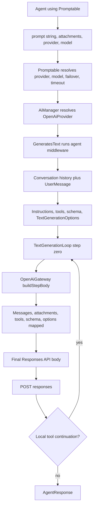

# Research

Research completed: 2026-07-19

This document records the evidence used to select the version-one architecture. Detailed workstream notes remain in [`research-laravel-ai.md`](research-laravel-ai.md), [`research-openai.md`](research-openai.md), and [`research-package-conventions.md`](research-package-conventions.md).

## Sources and versions

- [`laravel/ai` v0.9.1](https://github.com/laravel/ai/releases/tag/v0.9.1), commit `2760a62bff6ab515cdf10222f61b7973356450e1`, released 2026-07-15.
- [`laravel/ai` current `0.x`](https://github.com/laravel/ai/commit/a1b3ce7437adb8bda22eb4e0308a376cd64da3d9), commit `a1b3ce7437adb8bda22eb4e0308a376cd64da3d9`, inspected for drift but not selected as a compatibility target.
- Laravel AI [issue #767](https://github.com/laravel/ai/issues/767) and related [issue #59](https://github.com/laravel/ai/issues/59).
- Current official OpenAI [Batch guide](https://developers.openai.com/api/docs/guides/batch), [Batches reference](https://developers.openai.com/api/reference/resources/batches), and [Files reference](https://developers.openai.com/api/reference/resources/files).
- Current first-party `laravel/ai` and `laravel/pennant` package manifests, providers, tests, and CI workflows.

## Compatibility baseline

Laravel AI v0.9.1 requires PHP `^8.3`, Illuminate 12 or 13, and `illuminate/json-schema` `^12.62|^13.15`. Version one will require exactly `laravel/ai: 0.9.1`, PHP `^8.3`, and Laravel 12 or 13. The exact Laravel AI pin is intentional: the required request-building method is protected and therefore is not covered by upstream semantic-versioning promises.

The post-release `0.x` branch already changes approval state, prompt signatures, generation-loop parameters, and conversation behavior. Compatibility can expand only after a version-specific adapter and payload-parity suite pass for the new version.

## Laravel AI synchronous request path



`Promptable::prompt()` is the public application entry point. It accepts a string prompt, attachments, provider, model, and timeout. There is no public arbitrary context-array invocation API, so this package must mirror the string-prompt contract.

`OpenAiProvider::prompt()` runs Laravel's pipeline, lets middleware revise the prompt, reads conversation messages, appends the user message, resolves tools and structured schemas, creates `TextGenerationOptions`, and enters `TextGenerationLoop`.

The exact initial OpenAI body is created only inside protected `OpenAiGateway::buildStepBody()` / `buildTextRequestBody()` immediately before `POST responses`. It includes:

- the resolved model;
- system instructions, conversation history, prompt, and attachments;
- tool definitions and tool choice;
- structured JSON-schema format;
- max output tokens, temperature, and top-p;
- agent provider options, merged with the same precedence as synchronous Laravel AI;
- stateless `store` behavior and encrypted reasoning options where applicable.

Authorization is added later by the internal HTTP client and is not part of the provider body.

## Public Laravel AI APIs

The package may expose or accept these documented public concepts:

- `Laravel\Ai\Contracts\Agent` and `Agent::make()`;
- string prompts and supported attachment objects;
- `Laravel\Ai\Enums\Lab` or a configured provider connection name;
- agent contracts for conversations, tools, structured output, provider options, and middleware;
- agent configuration methods and attributes.

The package may internally compose `AiManager::textProvider()`, `TextProvider`, and `TextProvider::useTextGateway()`. They are public code contracts and the best available extension seam, but they are not an official resolved-request API.

## Internal Laravel AI details

The following are implementation details and must never appear in this package's public signatures or serialized state:

- `AgentPrompt`;
- concrete `OpenAiProvider` and `OpenAiGateway` instances;
- `TextGenerationLoop`, `TextGenerationOptions`, `StepContext`, and `StepResponse`;
- OpenAI mapping concern traits;
- Laravel AI message, tool, and schema objects after resolution;
- provider credentials, pending HTTP requests, and authorization headers.

## Stable extension point and fragile integration point

There is no stable public method that returns a provider request without sending it. The least invasive exact adapter is:

1. Resolve one explicit native OpenAI provider connection and model.
2. Clone the cached provider so a long-lived application's shared instance is not mutated.
3. Install a package-private capture gateway through `useTextGateway()`.
4. Invoke the cloned provider's normal `prompt(AgentPrompt)` pipeline.
5. In a package-private `OpenAiGateway` subclass, call inherited protected `buildStepBody()` with the real step-zero arguments and throw a private capture sentinel before any HTTP client is created.
6. Convert the captured body to a package-owned immutable `ResolvedProviderRequest` for `POST /v1/responses` without credential headers.

The public gateway replacement seam is relatively stable. Subclassing `OpenAiGateway` and calling protected `buildStepBody()` is the one deliberately fragile point. It must be isolated, version-pinned, reflection-tested, and parity-tested against the body observed from the real synchronous path under `Http::fake()`.

Copying OpenAI mapping traits, reflecting over multiple protected mappers, or building a second agent DSL would be more fragile and would create two sources of truth.

## Assumptions and known Laravel AI limitations

- Version one resolves exactly one provider and one initial Responses API request. Provider failover arrays are unsupported.
- Only a native OpenAI provider using the official OpenAI base URL is supported. Azure, openai-compatible drivers, and custom proxy/base URLs are rejected until researched.
- Request resolution can execute user code in instructions, messages, tools, schemas, provider options, model methods, and middleware. Determinism is bounded by that code.
- Short-circuiting middleware can mean no provider request exists; resolution then fails specifically.
- Exact resolution dispatches Laravel AI's normal pre-request event and can run middleware side effects. It does not persist a completed conversation turn because no response exists.
- Tool definitions can be preserved in the first request, but version one does not execute Laravel-side function, sub-agent, approval, or MCP continuations after asynchronous output. This is documented as a lifecycle limitation, never presented as completed agent-loop equivalence.
- Local and stored attachments are read during resolution and may be base64-expanded. Missing data and batch size violations fail before upload.
- Active Laravel AI fakes are rejected because they do not exercise the native provider builder.
- Streaming, queued-agent execution, and approval continuation are separate execution modes and are not batch inputs.

## Issue findings

Issue #59 requested a helper returning the complete provider payload for JSONL construction. It was closed as not planned; a maintainer explicitly invited a separate package implementation. Issue #767 separates the same low-level resolved-request need from a higher-level provider batch lifecycle. It remains open and provides direction, not a stability contract.

Keeping this package's resolved-request DTO independent allows a future official `toProviderRequest()` API to replace only the compatibility adapter.

## OpenAI Batch workflow

1. Encode one UTF-8 JSON object per line.
2. Upload the `.jsonl` file to `POST /v1/files` with `purpose=batch`.
3. Create the batch with `POST /v1/batches` using the input file ID, `/v1/responses`, and `completion_window: 24h`.
4. Retrieve with `GET /v1/batches/{id}` until terminal.
5. Request asynchronous cancellation with `POST /v1/batches/{id}/cancel` when needed.
6. Download output and error JSONL through `GET /v1/files/{file_id}/content`.

OpenAI currently accepts eight underlying endpoints, but version one enables only `/v1/responses`, the endpoint proven by the Laravel AI resolver. No support is claimed for embeddings, chat completions, legacy completions, moderation, image, or video batches.

## JSONL invariants and limits

Each line is:

```json
{"custom_id":"pr-123","method":"POST","url":"/v1/responses","body":{"model":"gpt-5.4-mini","input":"Summarize pull request 123."}}
```

The package must validate before upload:

- non-empty, byte-for-byte-preserved, unique `custom_id` values;
- method exactly `POST`;
- URL exactly `/v1/responses`;
- a JSON-object body with one non-empty model shared by every line;
- at most 50,000 request lines and at most 200 MB including newline bytes;
- independently valid compact JSON followed by `\n` for every record;
- no per-request semantic or credential headers.

OpenAI documents no maximum custom-ID length, so the package must not invent one. Model eligibility changes over time and remains provider-validated rather than hard-coded.

## OpenAI statuses

| Provider status | Meaning | Terminal |
| --- | --- | --- |
| `validating` | Input validation | No |
| `failed` | Input-file validation failed | Yes |
| `in_progress` | Requests executing | No |
| `finalizing` | Result files being prepared | No |
| `completed` | Result files available | Yes |
| `expired` | Completion window elapsed | Yes |
| `cancelling` | Cancellation draining | No |
| `cancelled` | Cancellation finished | Yes |

The domain also needs `unknown` while retaining the raw status. `completed` can still contain failed items. Batch status and per-item outcome are separate dimensions.

Cancellation may remain `cancelling` for up to ten minutes. Expired or cancelled batches can contain partial successful output plus errors for unfinished requests.

## Results and errors

Output ordering is not guaranteed. Every outcome is correlated by `custom_id`.

A line can contain a 2xx response, a non-2xx response, or a non-HTTP batch error such as `batch_expired`, `batch_cancelled`, or `request_timeout`. Unknown codes and additional optional fields must be tolerated and preserved. Malformed output is untrusted input and produces a parse exception with safe batch/file/line identifiers, never the full prompt or full line.

Batch-level validation errors are distinct from lifecycle HTTP failures and per-item output errors. The public model keeps those channels separate.

## HTTP and operational behavior

- Only the `24h` completion window is currently supported.
- Batch creation is documented at 2,000 batches per hour; model-specific enqueued-token limits also apply.
- Upload/create are not documented as idempotent. A lost response must surface an ambiguous-submission error rather than be blindly replayed.
- Reads can use bounded retries for connection failures, 429, and transient 5xx responses.
- A lost cancellation response should be reconciled by retrieval before retry.
- Provider request IDs and safe retry metadata may be retained; credentials and request bodies are redacted.
- Input files default to 30-day expiry, and generated outputs are also temporary. Applications should process needed results promptly.

## Laravel package conventions

The package follows current first-party conventions:

- PSR-4 Composer autoloading and Laravel package discovery;
- singleton manager/resolver/repository bindings;
- configuration merging in `register()`;
- console-only commands and tagged config/migration publishing;
- Orchestra Testbench with in-memory SQLite;
- Laravel HTTP fakes and credential-free fixtures;
- PHP 8.3/8.4/8.5 by Laravel 12/13 CI where dependency resolution permits;
- separate tests, Pint, and PHPStan gates.

Migrations are explicitly publishable and are not automatically run. Full prompts, request bodies, output bodies, secrets, and raw provider responses are not persisted by default.

## Architectural decision

Proceed with the version-pinned capture-gateway adapter, an OpenAI-only batch provider/client, immutable package DTOs, a small manager/facade API, replaceable repository persistence, and lazy result parsing. The accepted public design is recorded in [`architecture.md`](architecture.md).
